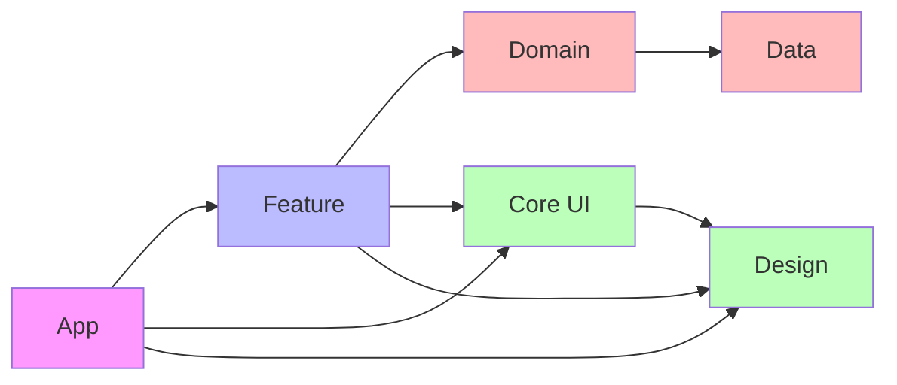

# Module Dependencies Graph

## Module Dependencies

- **App** → Feature, Core UI, Design
- **Feature** → Domain, Core UI, Design
- **Domain** → Data
- **Core UI** → Design
- **Design** → None
- **Data** → None 